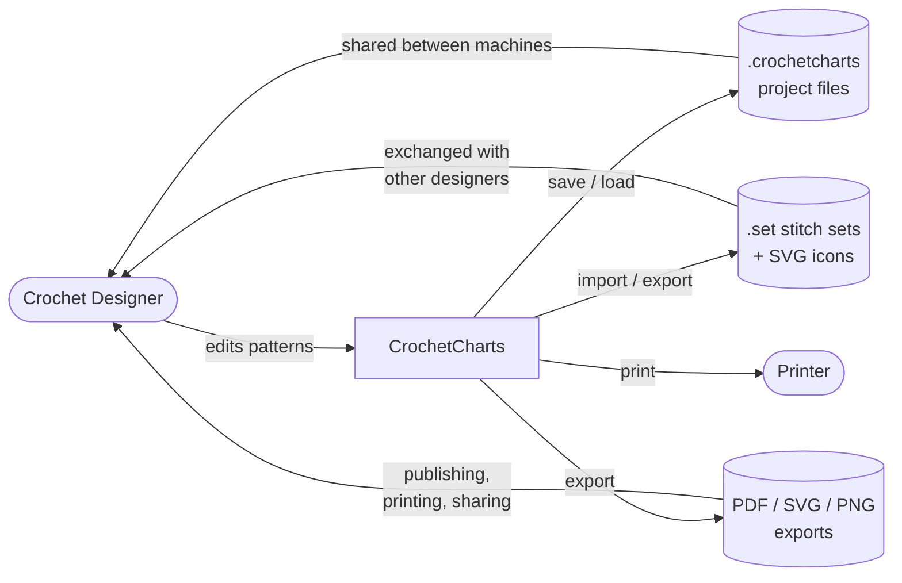
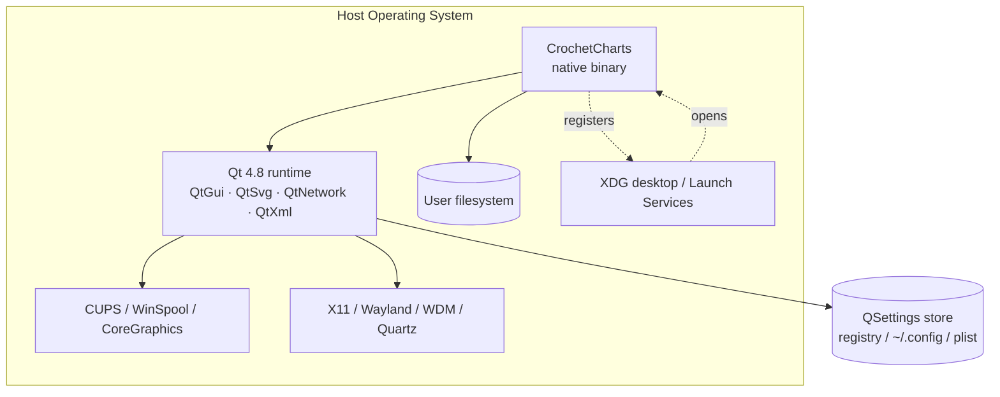

# 3. System Context and Scope

CrochetCharts is a single-user desktop application with no network services and no persistent state beyond user files. Its context is narrow.

## 3.1 Business Context

**Actors**
- **Crochet Designer** — sole user. Opens project files, composes charts, exports for publication.
- Other designers implicitly interact through shared `.set` files and project files.

**Produced / consumed artefacts**
- `.crochetcharts` — project file. See [08-crosscutting.md § Project file format](08-crosscutting.md#project-file-format).
- `.set` — stitch set. XML metadata + binary icon blob, see `src/stitchset.cpp`.
- PDF / SVG / PNG — export outputs, non-reversible.

## 3.2 Technical Context

**Interfaces**

| Direction | Interface | Protocol / format |
|---|---|---|
| GUI display | OS windowing system | X11 via Qt4, Win32, Cocoa |
| Print | OS print subsystem | `QPrinter` over CUPS / WinSpool / Quartz |
| File open/save | OS filesystem | Binary QDataStream (`v1`) or XML + QDataStream framing (`v2`) |
| File association | Desktop / Launch Services | `vnd.stitchworks.pattern` MIME / UTI, `.crochetcharts` extension. See `resources/vnd.stitchworks.pattern.xml`. |
| Settings | OS-native store | `QSettings` — Windows registry / `~/.config` / macOS plist |
| Stitch assets | Qt resource system + user filesystem | 129 built-in SVGs via `:/stitches/` (see `stitches/stitches.qrc`); user-added sets under `Settings::instance().userPath()` |
| Update check (optional) | HTTPS | `src/updater.cpp` polls an HTTP endpoint; disabled by default |

**Out of scope**
- No server-side component.
- No collaboration / multi-user editing.
- No cloud storage integration.
- No telemetry / crash reporting.

## 3.3 External Dependencies

See also `.devcontainer/Dockerfile` for the exact build-time set.

| Dependency | Role | Version pin |
|---|---|---|
| Qt 4.8 | GUI, SVG, XML, network | `find_package(Qt4 REQUIRED)` — any 4.8.x |
| Hunspell | Optional spell-check (declared but currently **unused** in code) | `FindHunSpell.cmake`; `-DHUNSPELL_FOUND` |
| CMake | Build | ≥ 2.8.6 |
| xsltproc + FOP + docbook-xsl | End-user manual build (opt-in `-DDOCS=ON`) | Not required for app |
| Apple Developer certificates (mac) | Code signing for store/DMG | Required only for distribution |
| NSIS (Windows) | Installer generator | CPack-invoked |
