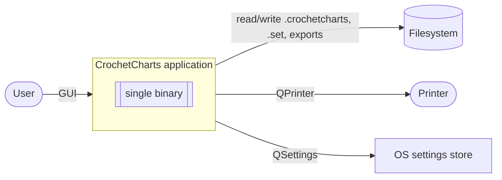
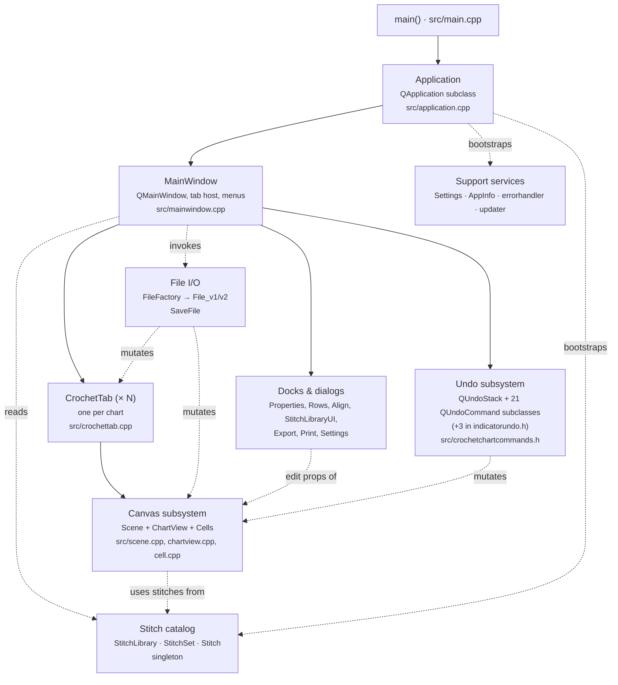
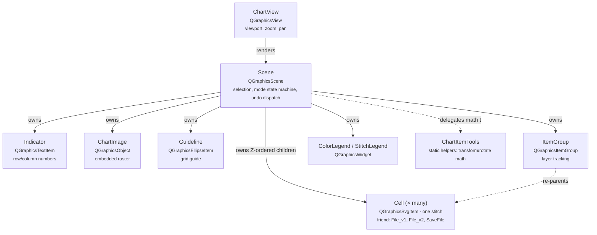
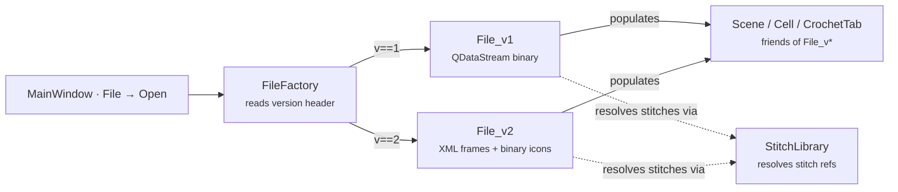

# 5. Building Block View

Top-down: black-box of the whole system → white-box of the app → internals of the hot modules.

## 5.1 Level 1 — Black box

The app is a single native binary per platform. No separate daemons, helper processes, or update services.

## 5.2 Level 2 — Main building blocks

The app decomposes into six coarse building blocks. Ownership (via `QObject` parent/child or explicit composition) is indicated by solid arrows; usage (pointer / signal) by dashed arrows.

### 5.2.1 Responsibilities

| Block | Responsibility | Key classes |
|---|---|---|
| Application bootstrap | Event loop, file-open events (macOS), installs message handler, loads `StitchLibrary` | `Application`, `main()`, `errorhandler` |
| Main window | Top-level UI shell: menus, toolbars, tab bar, status bar. Owns one tab per open chart, dispatches file commands, wires docks to the active tab. | `MainWindow` (2043 lines, 116 methods — large but not the god class) |
| Tab (document) | Groups one chart's Scene, View, undo stack, chart-specific metadata. Created per chart inside a project file. | `CrochetTab` |
| Canvas subsystem | Renders and edits the chart. All interactive logic for placing, moving, rotating, grouping, aligning, selecting, and stitch-mode switching lives here. | `Scene` (god class, 3626 lines), `ChartView`, `Cell`, `Indicator`, `ChartImage`, `Guideline`, `ItemGroup`, `ColorLegend`, `StitchLegend`, `ChartItemTools` |
| Stitch catalog | Holds all available stitches grouped into sets (built-in and user). Loads XML + SVG assets on first access. | `StitchLibrary` (singleton), `StitchSet`, `Stitch` |
| File I/O | Serialises/deserialises the whole chart graph. Versioned: `v1` is raw `QDataStream`, `v2` is XML frames + embedded binary icon blobs. | `File`, `FileFactory`, `File_v1`, `File_v2`, `SaveFile` |
| Undo subsystem | Centralised command pattern: every mutator pushes a typed command onto the active tab's `QUndoStack`. | `SetCellStitch`, `SetItemRotation`, `SetItemCoordinates`, `AddItem`, `RemoveItem`, `RemoveItems`, `GroupItems`, `UngroupItems`, plus `SetLayer*` family. See `src/crochetchartcommands.h`. Indicator undo is parallel — `indicatorundo.{cpp,h}` |
| Docks & dialogs | Side-panels and modal editors. `PropertiesDock` reacts to `Scene` selection, writes back via undo commands. | `PropertiesDock`, `RowsDock`, `AlignDock`, `StitchLibraryUI`, `ExportUI`, `SettingsUI` |
| Support services | Orthogonal infrastructure: persisted prefs, version info, Qt message hook, update poller. | `Settings::inst()`, `AppInfo::inst()`, `errorHandler()`, `Updater` |

## 5.3 Level 3 — Canvas subsystem internals

The hottest and most tangled module. Shown in more detail because new contributors must understand the ownership and mutation paths.

**Mode state machine.** `Scene` is an implicit state machine driven by `mMode` (stitch mode, rotate mode, scale mode, insert mode, colour mode, etc.). Each `mousePressEvent` / `mouseMoveEvent` / `mouseReleaseEvent` branches on `mMode`. Adding a new mode means: a new enum value, a new trio of event handlers, often a new cursor, usually a new undo command. The branching is the single largest source of complexity in the codebase.

> **Gotcha — double ownership.** A `Cell` can be a child of the `Scene` and simultaneously of an `ItemGroup`. When the group is dissolved, the cell is re-parented to the scene, not deleted. Deleting the group deletes its children. This order must be preserved in any refactor.

## 5.4 Level 3 — File I/O subsystem

The `friend class` grant on `Scene`, `Cell`, `CrochetTab`, `Indicator`, `MainWindow`, `StitchSet`, `StitchLibrary`, `TabInterface` is what lets `File_vN` (and `SaveFile` / `FileFactory`) set private fields directly. The coupling is intentional (§ 2.3) — do not try to remove it without first introducing explicit `toSerialised()` / `fromSerialised()` methods on every data class.

## 5.5 Boundaries and ownership cheatsheet

Condensed rules for memory ownership — essential because Qt4's `QGraphicsScene` has surprising semantics.

| Owns | Owned | Notes |
|---|---|---|
| `QApplication` | everything else, transitively | Destroyed in `main()` on `exec()` return. |
| `MainWindow` | `CrochetTab` instances (via `QTabWidget`) | Tab close deletes the tab, which deletes the Scene+View. |
| `CrochetTab` | `ChartView`, `Scene` (via QObject parent on `ChartView`), `QUndoStack` | `Scene` is constructed with `mView` as its `QObject` parent (`src/crochettab.cpp:61`: `mScene = new Scene(mView)`), so Qt's parent/child mechanism destroys the scene when the view is destroyed. `mView->setScene(mScene)` is separate from ownership and only registers the scene with the view. |
| `Scene` | every `QGraphicsItem` added to it | `addItem` transfers ownership to the scene. |
| `ItemGroup` | child items during grouping | `destroyItemGroup` hands children back to the scene. |
| `QUndoStack` | every `QUndoCommand` pushed onto it | Stack deletes on clear / overflow. |
| `StitchLibrary` (singleton) | all `StitchSet`s it loads | Lives for the process lifetime. |

Anything violating these rules is a bug. See [11-risks-and-debt.md § Ownership footguns](11-risks-and-debt.md).
