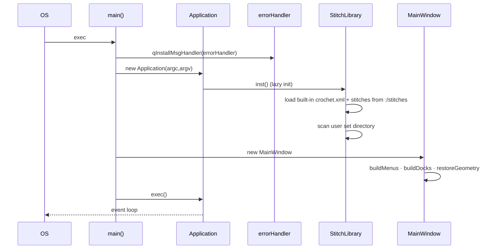
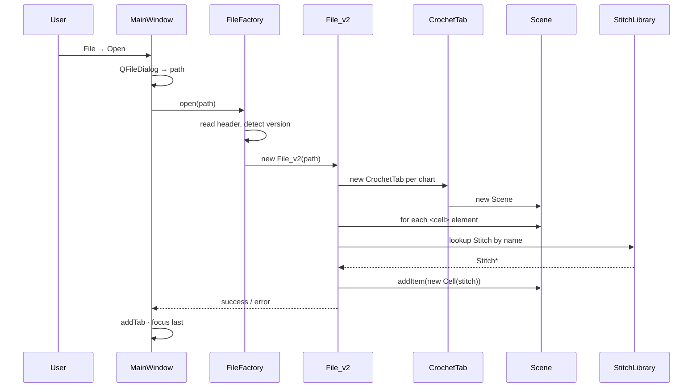
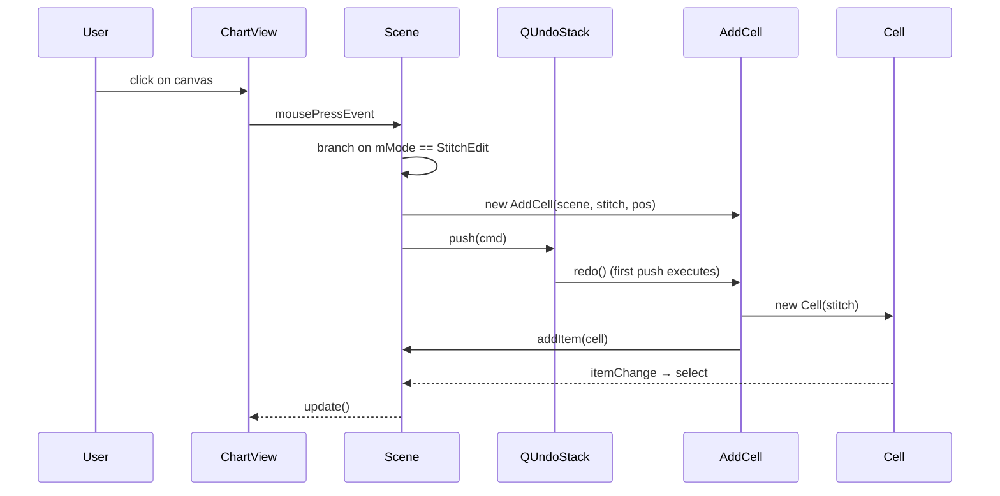
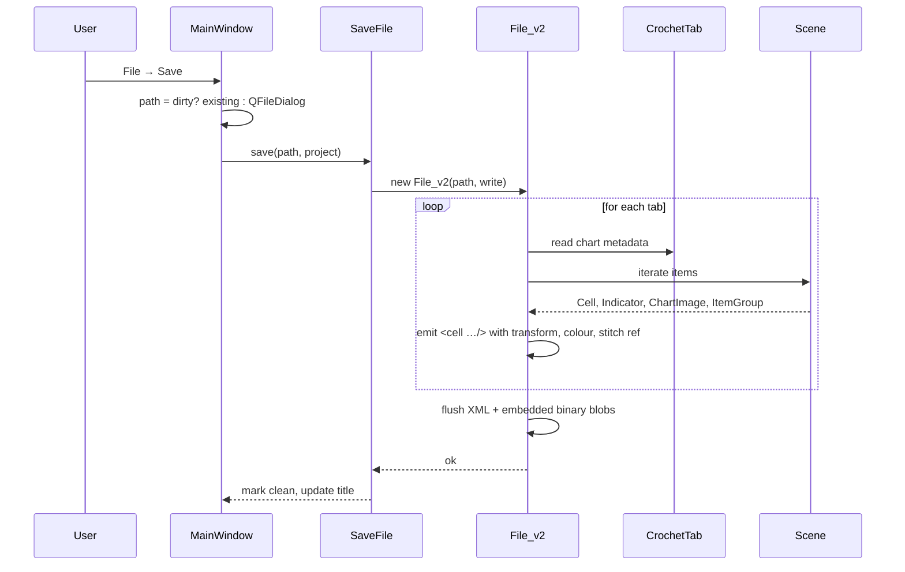
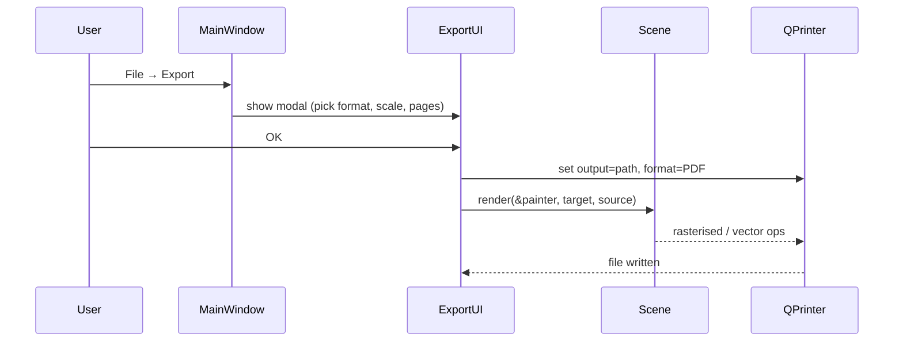
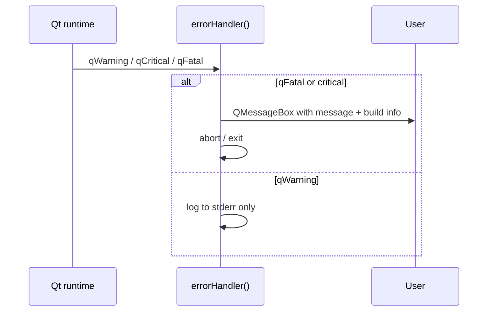

# 6. Runtime View

Key scenarios as sequence diagrams. Coverage is deliberately partial — scenarios chosen are the ones new contributors ask about.

## 6.1 Application startup

Notable:
- The message handler is installed before `QApplication` construction so even Qt-internal warnings route through `errorhandler`.
- On macOS, `Application` queues `QFileOpenEvent`s that arrive before `MainWindow` exists and replays them once it does. See `src/application.cpp`.

## 6.2 Opening a project file

- `File_v2` reaches into private members of `Scene`, `Cell`, `CrochetTab` via its friend grant. This is the intentional encapsulation break (§ 2.3).
- Unknown stitches fall back to `unknown.svg`; the cell keeps its name so a later stitch-set install resolves it.

## 6.3 Placing a stitch

The most frequent interactive path. Shown for "stitch mode".

Every mutator follows this shape:
1. Scene decides what to do based on `mMode`.
2. Scene constructs a typed `QUndoCommand` subclass.
3. The command's `redo()` performs the mutation; `undo()` reverses it.
4. Pushing onto the stack *automatically* calls `redo()` the first time.

Skipping the command path — mutating `Scene` directly — breaks undo/redo and is a bug.

## 6.4 Saving a project file

- Save is synchronous on the GUI thread. For realistic charts it completes in tens of milliseconds; for pathological ones it can stutter. See quality scenario QS-2 in [10-quality.md](10-quality.md).
- `v2` persists embedded icon binaries so a project opened on a machine without the stitch set still renders correctly.

## 6.5 Export to PDF

`QPrinter` in Qt4 handles PDF natively; SVG export goes through `QSvgGenerator` similarly; PNG through `QImage`. See `src/exportui.cpp`.

## 6.6 Crash path — message handler

Installed early in `main()`; ensures even pre-`MainWindow` Qt errors produce a dialog rather than silent stderr chatter.
