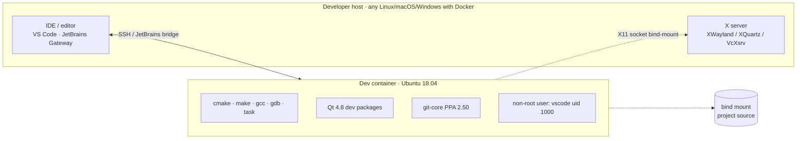
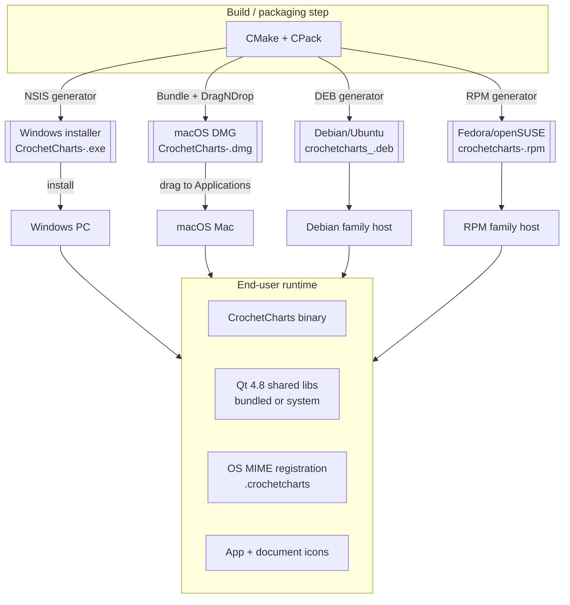

# 7. Deployment View

Two distinct deployment contexts: the development environment and the end-user install.

## 7.1 Development environment

**Base image:** `ubuntu:18.04` — chosen because Qt 4.8 packages (`qt4-default`, `libqt4-dev`, `libqt4-svg`, `libqtwebkit-dev`) are available on Bionic and were removed from 20.04+.

**Overlays on top of the EOL base:**
- `ppa:git-core/ppa` — current git (2.50) instead of the 2.17 Bionic ships with. See ADR-02.
- Non-root `vscode` user with UID/GID 1000 and passwordless sudo. Matches the typical host user so bind-mount writes land with the correct owner. See ADR-03.
- Task runner (`taskfile.dev`) installed from upstream script.
- DocBook toolchain: `xsltproc`, `fop`, `docbook-xsl`, `docbook-xsl-ns`. Enables `task docs` to build the end-user manual without leaving the container. See ADR-10.

**X11 forwarding:** `.devcontainer/devcontainer.json` passes `--net=host`, `-e DISPLAY=$DISPLAY`, and `-v /tmp/.X11-unix:/tmp/.X11-unix`. Host must run `xhost +local:` once per session.

**Build cycle (`Taskfile.yml`):**

| Task | Effect |
|---|---|
| `task build` | Debug build into `build/` |
| `task build:release` | Release build into `build_release/` |
| `task run` | Deps: `build`; launches `./build/src/CrochetCharts` |
| `task test` | Configures `-DUNIT_TESTING=ON`, builds, runs `build/tests/tests` under `xvfb-run` if available |
| `task profile` | Profile build, runs app under gprof, emits `profile.png` via `gprof2dot` |
| `task docs` | Build HTML + PDF of the end-user manual into `build_docs/docs/{html,pdf}/`. Uses xsltproc + FOP via `DocbookGen.cmake` at cmake-configure time; no `make` step required. |
| `task docs:clean` | Remove `build_docs/` only |
| `task clean` | Removes all `build*` directories (incl. `build_docs`) |
| `task setup` | Installs git hooks from `utils/hooks/` |
| `task _clear-stale-cache` | Internal: wipes `build/` if `CMAKE_HOME_DIRECTORY` in `CMakeCache.txt` no longer matches CWD |

## 7.2 End-user deployment

### 7.2.1 Platform-specific assets

| Platform | Assets in repo | CPack generator |
|---|---|---|
| Windows | `crochet.rc` (icon resource), `resources/installers.cmake` (NSIS config), `images/*.ico` | `NSIS` — monolithic installer, Start-Menu entry, doc shortcut, uninstaller |
| macOS | `resources/Entitlements.plist` (sandbox: print + file r/w), `Crochet Charts.iconset`, `PatternDocument.iconset`, DMG background (`dmg_background.pdf`), codesign cert list (5 Qt frameworks + 10 plugins) | `Bundle` + `DragNDrop` — `.app` bundle, signed, DMG with custom chrome. Two cert modes: Developer ID (direct distribution) vs App Store (3rd Party Mac Developer) |
| Linux | `resources/CrochetCharts.desktop.in` (→ `.desktop` at install), `resources/vnd.stitchworks.pattern.xml` (XDG MIME), `resources/deb/{postinst,prerm}` (xdg-mime + xdg-desktop-menu), `images/*.png` (icon sizes) | `DEB` and `RPM` — dependencies: `libqtgui4`, `libqtcore4`, `libqt4-svg`, `libqt4-xml`, `libqt4-network` ≥ 4.7.0 |

### 7.2.2 Version string

`cmake/modules/version.cpp.in` is configured from `git describe --tags --dirty=w`. The resulting `build/version.cpp` feeds `AppInfo`. Tag format is `MAJOR.MINOR.PATCH`; a dirty tree appends `w`. Untagged commits produce a string that `AppInfo` cannot parse cleanly — **tag before packaging**.

## 7.3 Runtime layout

The app assumes:

- A writable user data directory (Qt's `QDesktopServices` / `QStandardPaths` equivalents in Qt4) for user `.set` files.
- Read-only access to bundled assets via `:/` resource URLs.
- An OS-native settings store (see [03-context.md § 3.2](03-context.md#32-technical-context)).

There is no uninstall script beyond what the native installer handles. Removing the binary leaves `QSettings` data and the user stitch set directory intact by design.

## 7.4 On-demand Docker packaging (2026-04)

Linux `.deb`/`.rpm` and Windows NSIS `.exe` are produced via dedicated Docker images instead of by the developer's host directly:

- `task package:linux` builds inside the Bionic-based Linux devcontainer and emits `.deb` + `.rpm` to `./artifacts/`. CPack generators are unchanged; only the runner moved.
- `task images:build:win` (host, one-time, 30-60 min) builds a sibling image based on `debian:bookworm-slim` with [MXE](https://mxe.cc/) targeting `x86_64-w64-mingw32.static`. Qt is linked statically, so the resulting NSIS installer ships no DLLs.
- `task package:win` (host) cross-compiles the Windows installer using that image and emits `./artifacts/Crochet_Charts-<ver>-win64.exe`.
- The `MXE_REF` pin lives in `.devcontainer/win/Dockerfile`; bump via `--build-arg MXE_REF=<sha>` if upstream breaks.

See `README.md` § "Building installers" and `Taskfile.yml` for the full task surface.

## 7.5 Deployment risks

- **Qt4 is unavailable** on modern distros. Linux DEB/RPM installs on Ubuntu ≥ 20.04 require manual Qt4 acquisition or bundling. The Linux packaging path is anchored to the Bionic devcontainer; native host builds on newer distros are not supported.
- **macOS notarization** is not configured. Code-signing is present; notarization is needed for Gatekeeper-free launch on recent macOS. Add to CPack-Mac signing step if resumed.
- **Windows code-signing** is not configured. Users hit SmartScreen warnings.

See [11-risks-and-debt.md](11-risks-and-debt.md).
