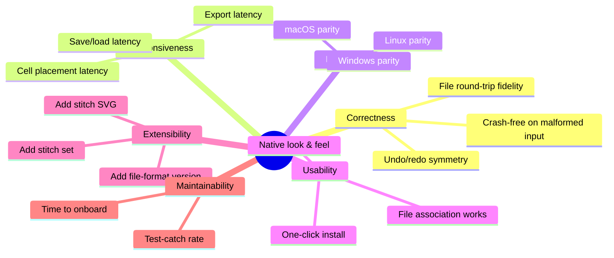

# 10. Quality Requirements

Refines [01-introduction-and-goals.md § 1.3](01-introduction-and-goals.md#13-quality-goals) into testable scenarios.

## 10.1 Quality Tree

The tree is ordered left-to-right by priority. Branches further right can be traded off for branches further left.

## 10.2 Quality Scenarios

Each scenario is stated as: *stimulus · environment · response · measure*.

### QS-1 · File round-trip correctness
- **Stimulus:** User opens a `v1` or `v2` file, makes no edits, saves.
- **Environment:** Any supported OS.
- **Response:** The resulting file produces an identical in-memory chart when reopened.
- **Measure:** `tests/testfilefactory.cpp` must contain a round-trip test per persisted field. Failure = regression.

### QS-2 · Save latency for a typical chart
- **Stimulus:** User hits Save on a chart of 500 cells, 20 indicators, 5 images.
- **Environment:** Hobbyist laptop (≈ 8 GB RAM, SSD).
- **Response:** Save completes synchronously.
- **Measure:** ≤ 200 ms. Beyond 500 ms, introduce a progress indicator or a background thread (violates ADR-08, requires ADR update).

### QS-3 · Cell placement latency
- **Stimulus:** User clicks on the canvas in Stitch Mode.
- **Environment:** Chart of 1 000 cells.
- **Response:** New cell appears, hit-test resumes.
- **Measure:** ≤ 50 ms from click to redraw. Currently met by Qt's scene graph without effort.

### QS-4 · Opening a file with missing stitches
- **Stimulus:** User opens a `v2` file containing a stitch name not in their library.
- **Environment:** Any supported OS.
- **Response:** File opens; unknown stitches render as `unknown.svg` placeholder; user receives a dialog listing the missing stitches.
- **Measure:** No crash. Placeholder rendering deterministic.

### QS-5 · Portability — identical files across OSes
- **Stimulus:** User saves a file on Windows, opens on macOS.
- **Environment:** Same project version both sides.
- **Response:** Identical in-memory chart.
- **Measure:** Byte-identical `.crochetcharts` output from a deterministic sequence of operations on all three platforms. Currently only manually verified.

### QS-6 · Install on a fresh user machine
- **Stimulus:** A non-technical user runs the installer for their platform.
- **Environment:** Fresh Windows 10+/macOS 12+/Ubuntu 18.04 install.
- **Response:** App appears in applications menu, `.crochetcharts` files open with a double-click, document icon is correct.
- **Measure:** Manual checklist. No failure point in installer.

### QS-7 · Adding a new stitch without code changes
- **Stimulus:** A contributor wants to add a new stitch without rebuilding.
- **Environment:** Installed app.
- **Response:** Drops an SVG + XML definition into their user `.set` directory; the stitch appears in the picker on next launch.
- **Measure:** Documented in `stitches/AGENTS.md` and reproducible.

### QS-8 · Undo/redo symmetry
- **Stimulus:** For any user-triggered mutation.
- **Environment:** Any.
- **Response:** `Ctrl+Z` + `Ctrl+Y` returns the document to the exact pre-mutation state.
- **Measure:** Every mutator has a matching command class; every new command class has a test or documented rationale if untestable.

### QS-9 · Onboarding time
- **Stimulus:** A competent C++/Qt4 engineer joins the project.
- **Environment:** Access to this arc42 doc and `AGENTS.md`.
- **Response:** Can build, run, and land a small fix (adding a property, for example).
- **Measure:** Target: less than one day. Currently believed met for small changes; not measured.

## 10.3 Not measured

- **Test-catch rate.** Coverage is ≈ 5 %. Improving it is desirable but not currently tracked.
- **Memory footprint.** No budget set. Anecdotally a charted project of 500 cells uses well under 200 MB.
- **Startup time.** No budget. Anecdotally ≤ 1 s on modern hardware.
